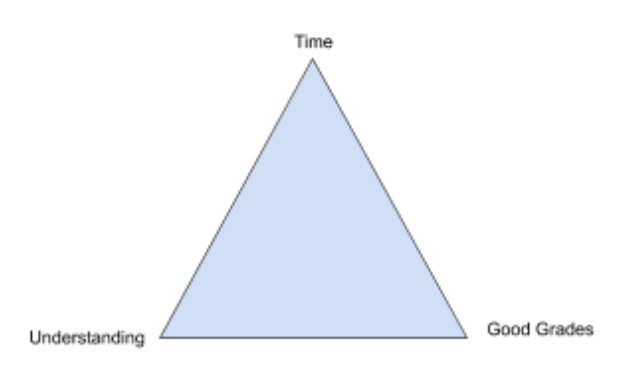

Our time in school is short. In this short time we need to learn skills to be productive and contributing members of society.
Our priority is to properly use our time to gain knowlege, technical and social skills and understand them well enough to use it to solve  real-world problems.

## The Trade-Off Triangle
To understand how and what we want to get from school, we can make use of a model known as the “Trade-off Triangle”. 

## Cost of Good Grades 
A student wants to get good grades to get to the next stage of the academic chain. 
But there is a trade-off between understanding and getting good grades. Let us consider one subject, example Mathematics.

In this case the trade-off triangle’s 3 factors are:

1. Time
1. Good Grades
1. Good Understanding

You can only get/have two out of the three factors in the triangle.

For example:
1. If you want time for good grades, then you need to forgo understanding.
This method is called rote learning. Students are given lots of practice in exam questions where they memorise many model answers. The students score highly in exams but they easily forget what they have learned after a short period of time. Despite the good grades, the students have difficulty using this knowledge to solve new problems.
1. If you want time for good understanding then you have to forgo good grades.
1. If you want good understanding and good grades, then you don’t have time. You have to consider a trade-off.

## Making a Trade-off between Good Grades and Good Understanding

When we remove time, the triangle collapses to form a line.

A student may want to consider trading off some marks for some understanding. This means that the student will need to sacrifice some marks to gain some understanding in the subject.

Why trade marks for understanding?
Students start at primary school, progress to junior high, senior high and then college. Most students aim to score the highest marks at the end of each stage of school. Pupils with the highest marks get rewarded with prizes, awards and a fantastic certificate. More importantly, they gain entry into the best classes and the best schools. It is like a passport.

However, once you get into your school of choice, you start at the same place as everyone else. Your good marks and grades from your previous exam become irrelevant. Students who have more understanding may have an advantage. They usually find it easier to master the new material. 

## The Importance of Social Interactions
Many students forget about the importance of social interactions.
The 3 factors in this “Trade-Off Triangle” are:

1. Time
1. Studies
1. Social

During the Covid 19 pandemic, schools were closed for several months to prevent the infection from spreading. Students managed to keep up with their studies through online learning. Students had little, if any, group social interactions that they usually experience in school. They had little chance to practise social skills which include responsibility, making friends, conflict resolution

Looking at the triangle and from our experience we can see that if we want all the time for our studies, then we won’t have time for social interactions. We can see that we will need to make a  trade-off if we want to develop socially.

## Summary

Please decide what is important to you. Figure out what you want out of school.
You will need to make trade-offs. Your goal is to be independent, be productive and relevant to society.
Everyone will have different priorities. Know what you want.
